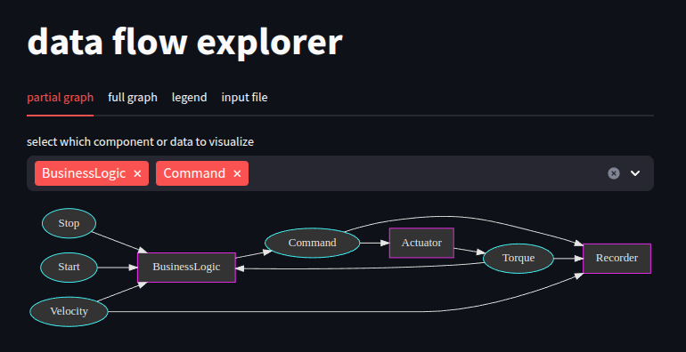

# About

Visualizing the data flow in large systems can be challenging. The graph representing the entire data flow between components may become vast and complex. To address this, this repository offers a tool that allows users to interactively select and hide specific data flow elements.

# Demo



# Install

```shell
git clone https://github.com/t4n0/data_flow_explorer.git
cd data_flow_explorer
python -m venv .venv
source .venv/bin/activate
pip install -r requirements.txt
```

# Run

```shell
cd <path_to_data_flow_explorer>
streamlit run ./data_flow_explorer.py -- --input_file data_flow_example.json
```

# Compatibility

Tested with Ubuntu 24.04 only.

# Test

```shell
export PYTHONPATH=<path_to_data_flow_explorer>
cd <path_to_data_flow_explorer>
pytest .
```
